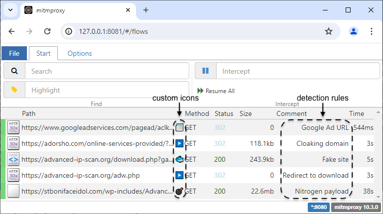

# fiddleitm v.1.1

This is an addon for [**mitmproxy**](https://github.com/mitmproxy/mitmproxy) that inspects flows and identifies malicious web traffic.

If you'd like the flows to be highlighted (in addition to the comments and emojis), simply type ``~marked`` in the filter section:

**Usage:**

To launch the mitmproxy interactive proxy:

`mitmproxy -s fiddleitm.py`

To launch the web interface:

`mitmweb -s fiddleitm.py`

To launch the command-line version of mitmproxy (useful for capturing a lot of traffic):

`mitmdump -s fiddleitm.py`

Options:

* override default user-agent: ``--set custom_user_agent=""``

* modify default referer with your own --set custom_referer=""

* overrride default accept-language: ``--set custom_accept_language=""``

* log events for rules that match flows (writes to *rules.log*): ``--set log_events=true``

* add upstream proxy: ``--mode upstream:http://proxyhost:port --upstream-auth username:password``

# Features

## Malicious traffic detection based on rules

Currently, **fiddleitm** inspects the following:

* remote host name IP address
* remote host IP address
* remote host full URL
* response body

Predefined [rules](https://github.com/jeromesegura/fiddleitm/blob/main/rules.txt) are loaded from this GitHub repository.

You can add your own rules to a file called ``localrules.txt`` placed in the same directory as ``fiddleitm.py``.

**Syntax for rules:**

``rule_name = "rule name"; condition 1 = "string" ; condition 2 = /regex/; condition n = ...``

**List of conditions:**

* ``host_name``

* ``host_ip``

* ``full_url``

* ``response_body``

**Optional:**
* ``emoji_name``
  (Displays an emoji to mark the flow. Please note that the `emoji_name` must be placed at the end of your rule. List of emojis: https://api.github.com/emojis)

**Example:**

``rule_name = "My first rule"; full_url = /[a-z]{5}\.js/; response_body = "DevTools"; emoji_name = ":grapes:"``

## Anti-VM detection and evasion

Threat actors can use JavaScript code to fingerprint visitors and detect if they are running a virtual machine (VMware, VirtualBox). In some instances, this works by collecting information such as video drivers, renders, etc. and then sending that information backed to the server via a POST request.

fiddleitm intercepts such attempts and replaces certain keywords commonly used to detect virtual machines with random words.

